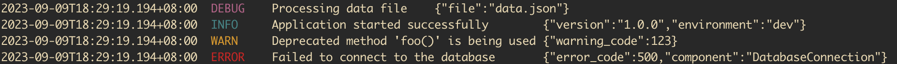

# zlog - JSON structured handler/logger for Golang slog

[](https://pkg.go.dev/github.com/icefed/zlog)
[](https://goreportcard.com/report/github.com/icefed/zlog)

[](https://codecov.io/gh/icefed/zlog)
[](./LICENSE)

## Features
- JSON Structured logging
- Logger with format method(printf-style)
- Development mode with human-friendly output
- WithCallerSkip to skip caller
- Context extractor for Record context
- Custom time formatter for buildin attribute time value

## Usage

Because zlog implements the slog.Handler interface, you can create a zlog.JSONHander and use slog.Logger.
```go
import (
    "log/slog"

    "github.com/icefed/zlog"
)

func main() {
    h := zlog.NewJSONHandler(&zlog.Config{
		HandlerOptions: slog.HandlerOptions{
			Level: slog.LevelDebug,
		},
    })
    log := slog.New(h)

    log.Info("hello world")
    // ...
    log.With(slog.String("app", "test")).
        Error("db execution failed", "error", err)
    log.LogAttrs(context.Background(), slog.LevelInfo, "this is a info message", slog.String("app", "test"))
}
```

Or you can use zlog.Logger, which implements all slog.Logger methods and is compatible.
Then you can use Infof and other methods that support format format.
```go
import (
	"context"
	"log/slog"

	"github.com/icefed/zlog"
)

func main() {
	h := zlog.NewJSONHandler(&zlog.Config{
		HandlerOptions: slog.HandlerOptions{
			Level: slog.LevelDebug,
		},
	})
	log := zlog.New(h)
	log.Info("hello world")

	log.Log(context.Background(), slog.LevelInfo, "this is a info message")
	// ...
	log.Debugf("get value %s from map by key %s", v, k)
}
```

### Development mode

Development mode, like zap development, outputs buildin attributes in Text format for better readability.  If development mode is enabled and writer is a terminal, the level field will be printed in color.
```go
package main

import (
	"log/slog"

	"github.com/icefed/zlog"
)

func main() {
	// start development mode with Config
	h := zlog.NewJSONHandler(&zlog.Config{
		HandlerOptions: slog.HandlerOptions{
			Level: slog.LevelDebug,
		},
		Development: true,
	})

	// turn on development mode with WithOptions
	h = h.WithOptions(zlog.WithDevelopment(true))
	log := zlog.New(h)

	log.Debug("Processing data file", "file", "data.json")
	log.Info("Application started successfully",
		slog.String("version", "1.0.0"),
		slog.String("environment", "dev"))
	log.Warn("Deprecated method 'foo()' is being used", slog.Int("warning_code", 123))
	log.Error("Failed to connect to the database", "error_code", 500, "component", "DatabaseConnection")
}
```

Outputs:


### Enable stack trace

Set StacktraceEnabled to true to enable printing log stack trace, the default print slog.LevelError above the level,
```go
h := zlog.NewJSONHandler(&zlog.Config{
    HandlerOptions: slog.HandlerOptions{
        Level: slog.LevelDebug,
    },
    StacktraceEnabled: true,
})

// set custom stacktrace key
h = h.WithOptions(zlog.WithStacktraceKey("stack"))
```

### Custom time formatter

By default, when printing logs, the time field is formatted with `RFC3339Milli`(`2006-01-02T15:04:05.999Z07:00`). If you want to modify the format, you can configure TimeFormatter in Config.
```go
h := zlog.NewJSONHandler(&zlog.Config{
    HandlerOptions: slog.HandlerOptions{
        Level: slog.LevelDebug,
    },
    TimeFormatter: func(buf []byte,t time.Time) []byte {
        return t.AppendFormat(buf, time.RFC3339Nano)
    },
})

log := zlog.New(h)
log.Info("this is a log message with RFC3339Nano format")

// use int timestamp format with microsecond precision
log = log.WithOptions(zlog.WithTimeFormatter(func(buf []byte, t time.Time) []byte {
    return strconv.AppendInt(buf, t.UnixMicro(), 10)
}))
log.Info("this is a log message in int timestamp format")
```

Outputs:
```
{"time":"2023-09-09T19:02:28.704746+08:00","level":"INFO","msg":"this is a log message with RFC3339Nano format"}
{"time":"1694257348705059","level":"INFO","msg":"this is a log message with int timestamp format"}
```

### Context extractor

We often need to extract the value from the context and print it to the log, for example, an apiserver receives a user request and prints trace and user information to the log.

The following is an example of printing a user request in http server. The log contains user information and can be used as an audit log.

```go
func AuthMiddleware(next http.Handler) http.Handler {
	return http.HandlerFunc(func(w http.ResponseWriter, r *http.Request) {
		// ...
		// Pretend that we read and parsed the token, and the user authentication succeeded
		ctx := context.WithValue(context.Background(), userKey{}, user{
			Name: "test@test.com",
			Id:   "a2067a0a-6b0b-4ee5-a049-16bdb8ed6ff5",
		})
		next.ServeHTTP(w, r.WithContext(ctx))
	})
}

func LogMiddleware(log *zlog.Logger, next http.Handler) http.Handler {
	return http.HandlerFunc(func(w http.ResponseWriter, r *http.Request) {
		start := time.Now()

		next.ServeHTTP(w, r)

		duration := time.Since(start)
		log.InfoContext(r.Context(), "Received request",
			slog.String("method", r.Method),
			slog.String("path", r.URL.Path),
			slog.String("duration", duration.String()),
		)
	})
}

func hello(w http.ResponseWriter, r *http.Request) {
	w.WriteHeader(http.StatusOK)
	w.Write([]byte("Hello, World!"))
}

func userContextExtractor(ctx context.Context) []slog.Attr {
	user, ok := ctx.Value(userKey{}).(user)
	if ok {
		return []slog.Attr{
			slog.Group("user", slog.String("name", user.Name), slog.String("id", user.Id)),
		}
	}
	return nil
}

func main() {
	h := zlog.NewJSONHandler(&zlog.Config{
		HandlerOptions: slog.HandlerOptions{
			Level: slog.LevelDebug,
		},
	})
	h = h.WithOptions(zlog.WithContextExtractor(userContextExtractor))
	log := zlog.New(h)

	httpHandler := http.HandlerFunc(hello)
	// set auth middleware
	handler := AuthMiddleware(httpHandler)
	// set log middleware
	handler = LogMiddleware(log, handler)

	log.Info("starting server, listening on port 8080")
	http.ListenAndServe(":8080", handler)
}

type userKey struct{}
type user struct {
	Name string
	Id   string
}
```

Send a request using curl.
```bash
curl http://localhost:8080/api/v1/products
Hello, World!
```

Outputs:
```
{"time":"2023-09-09T19:51:55.683+08:00","level":"INFO","msg":"starting server, listening on port 8080"}
{"time":"2023-09-09T19:52:04.228+08:00","level":"INFO","msg":"Received request","user":{"name":"test@test.com","id":"a2067a0a-6b0b-4ee5-a049-16bdb8ed6ff5"},"method":"GET","path":"/api/v1/products","duration":"6.221µs"}
```

The example of OpenTelemetry TraceContextExtractor.
[TraceContext](https://pkg.go.dev/github.com/icefed/zlog#example-ContextExtractor-TraceContext)


## Benchmarks

Test modified from [zap benchmarking suite](https://github.com/uber-go/zap/tree/master/benchmarks).  Only the zap, zerolog, slog, zlog loggers are retained.

Because zap and zerolog support MarshalObject interface to improve object encode performance, but slog does not support it, so non-MarshalObject objects are also tested here.

```bench
goos: darwin
goarch: arm64
pkg: go.uber.org/zap/benchmarks
BenchmarkDisabledWithoutFields/Zap-10     	1000000000	         0.5976 ns/op	       0 B/op	       0 allocs/op
BenchmarkDisabledWithoutFields/Zap.Sugar-10         	346361454	         9.847 ns/op	      16 B/op	       1 allocs/op
BenchmarkDisabledWithoutFields/Zap.SugarFormatting-10         	42086342	        56.21 ns/op	     136 B/op	       6 allocs/op
BenchmarkDisabledWithoutFields/rs/zerolog-10                  	1000000000	         0.3232 ns/op	       0 B/op	       0 allocs/op
BenchmarkDisabledWithoutFields/slog-10                        	1000000000	         0.6154 ns/op	       0 B/op	       0 allocs/op
BenchmarkDisabledWithoutFields/slog.zaphandler-10             	1000000000	         0.7660 ns/op	       0 B/op	       0 allocs/op
BenchmarkDisabledWithoutFields/slog.zloghandler-10            	1000000000	         0.5928 ns/op	       0 B/op	       0 allocs/op
BenchmarkDisabledWithoutFields/zlog-10                        	1000000000	         0.5674 ns/op	       0 B/op	       0 allocs/op
BenchmarkDisabledWithoutFields/zlog.Formatting-10             	37454059	        63.80 ns/op	     136 B/op	       6 allocs/op
BenchmarkDisabledAccumulatedContext/Zap-10                    	1000000000	         0.5905 ns/op	       0 B/op	       0 allocs/op
BenchmarkDisabledAccumulatedContext/Zap.Sugar-10              	324995505	         9.024 ns/op	      16 B/op	       1 allocs/op
BenchmarkDisabledAccumulatedContext/Zap.SugarFormatting-10    	39587138	        65.36 ns/op	     136 B/op	       6 allocs/op
BenchmarkDisabledAccumulatedContext/rs/zerolog-10             	1000000000	         0.3103 ns/op	       0 B/op	       0 allocs/op
BenchmarkDisabledAccumulatedContext/slog-10                   	1000000000	         0.5856 ns/op	       0 B/op	       0 allocs/op
BenchmarkDisabledAccumulatedContext/slog.zaphandler-10        	1000000000	         0.7274 ns/op	       0 B/op	       0 allocs/op
BenchmarkDisabledAccumulatedContext/slog.zloghandler-10       	1000000000	         0.5851 ns/op	       0 B/op	       0 allocs/op
BenchmarkDisabledAccumulatedContext/zlog-10                   	1000000000	         0.5400 ns/op	       0 B/op	       0 allocs/op
BenchmarkDisabledAccumulatedContext/zlog.Formatting-10        	34952918	        64.34 ns/op	     136 B/op	       6 allocs/op
BenchmarkDisabledAddingFields/Zap-10                          	 9234999	       257.3 ns/op	     736 B/op	       5 allocs/op
BenchmarkDisabledAddingFields/Zap.Sugar-10                    	35595940	        64.27 ns/op	     136 B/op	       6 allocs/op
BenchmarkDisabledAddingFields/rs/zerolog-10                   	200183110	        11.96 ns/op	      24 B/op	       1 allocs/op
BenchmarkDisabledAddingFields/slog-10                         	11475495	       206.7 ns/op	     536 B/op	       6 allocs/op
BenchmarkDisabledAddingFields/slog.zaphandler-10              	11647605	       206.9 ns/op	     536 B/op	       6 allocs/op
BenchmarkDisabledAddingFields/slog.zloghandler-10             	11737071	       205.6 ns/op	     536 B/op	       6 allocs/op
BenchmarkDisabledAddingFields/zlog-10                         	11583421	       207.2 ns/op	     536 B/op	       6 allocs/op
BenchmarkWithoutFields/Zap-10                                 	56544705	        48.74 ns/op	       0 B/op	       0 allocs/op
BenchmarkWithoutFields/Zap.Sugar-10                           	35700538	        67.88 ns/op	      16 B/op	       1 allocs/op
BenchmarkWithoutFields/Zap.SugarFormatting-10                 	 1505811	      1595 ns/op	    1922 B/op	      58 allocs/op
BenchmarkWithoutFields/rs/zerolog-10                          	100000000	        30.94 ns/op	       0 B/op	       0 allocs/op
BenchmarkWithoutFields/rs/zerolog.Formatting-10               	 1556541	      1554 ns/op	    1915 B/op	      58 allocs/op
BenchmarkWithoutFields/slog-10                                	 9841291	       245.1 ns/op	       0 B/op	       0 allocs/op
BenchmarkWithoutFields/slog.zaphandler-10                     	30395377	        90.22 ns/op	       0 B/op	       0 allocs/op
BenchmarkWithoutFields/slog.zloghandler-10                    	29850390	        80.98 ns/op	       0 B/op	       0 allocs/op
BenchmarkWithoutFields/zlog-10                                	44637580	        56.80 ns/op	       0 B/op	       0 allocs/op
BenchmarkWithoutFields/zlog.Formatting-10                     	 1686939	      1435 ns/op	    1276 B/op	      57 allocs/op
BenchmarkAccumulatedContext/Zap-10                            	43512088	        51.23 ns/op	       0 B/op	       0 allocs/op
BenchmarkAccumulatedContext/Zap.Sugar-10                      	33498090	        70.62 ns/op	      16 B/op	       1 allocs/op
BenchmarkAccumulatedContext/Zap.SugarFormatting-10            	 1475952	      1610 ns/op	    1926 B/op	      58 allocs/op
BenchmarkAccumulatedContext/rs/zerolog-10                     	85710969	        32.07 ns/op	       0 B/op	       0 allocs/op
BenchmarkAccumulatedContext/rs/zerolog.Formatting-10          	 1535347	      1567 ns/op	    1916 B/op	      58 allocs/op
BenchmarkAccumulatedContext/slog-10                           	 9633142	       255.5 ns/op	       0 B/op	       0 allocs/op
BenchmarkAccumulatedContext/slog.zaphandler-10                	27362756	        84.53 ns/op	       0 B/op	       0 allocs/op
BenchmarkAccumulatedContext/slog.zloghandler-10               	27954474	        86.78 ns/op	       0 B/op	       0 allocs/op
BenchmarkAccumulatedContext/zlog-10                           	46082322	        50.92 ns/op	       0 B/op	       0 allocs/op
BenchmarkAccumulatedContext/zlog.Formatting-10                	 1613914	      1467 ns/op	    1277 B/op	      57 allocs/op
BenchmarkAddingFields/Zap-10                                  	 3834751	       626.1 ns/op	     740 B/op	       5 allocs/op
BenchmarkAddingFields/Zap.WithoutObjectMarshal-10             	 1954508	      1224 ns/op	    1420 B/op	      18 allocs/op
BenchmarkAddingFields/Zap.Sugar-10                            	 2485612	       950.4 ns/op	    1498 B/op	      10 allocs/op
BenchmarkAddingFields/Zap.Sugar.WithoutObjectMarshal-10       	 1544667	      1578 ns/op	    2182 B/op	      23 allocs/op
BenchmarkAddingFields/rs/zerolog-10                           	 8181747	       284.0 ns/op	      24 B/op	       1 allocs/op
BenchmarkAddingFields/rs/zerolog.WithoutObjectMarshal-10      	 2102283	      1135 ns/op	    1661 B/op	      16 allocs/op
BenchmarkAddingFields/slog-10                                 	  988268	      2381 ns/op	    3371 B/op	      40 allocs/op
BenchmarkAddingFields/slog.zaphandler-10                      	 1851842	      1294 ns/op	    1380 B/op	      24 allocs/op
BenchmarkAddingFields/slog.zloghandler-10                     	 2059356	      1173 ns/op	    1160 B/op	      22 allocs/op
BenchmarkAddingFields/zlog-10                                 	 2094583	      1140 ns/op	    1160 B/op	      22 allocs/op
PASS
ok  	go.uber.org/zap/benchmarks	140.293s
```
